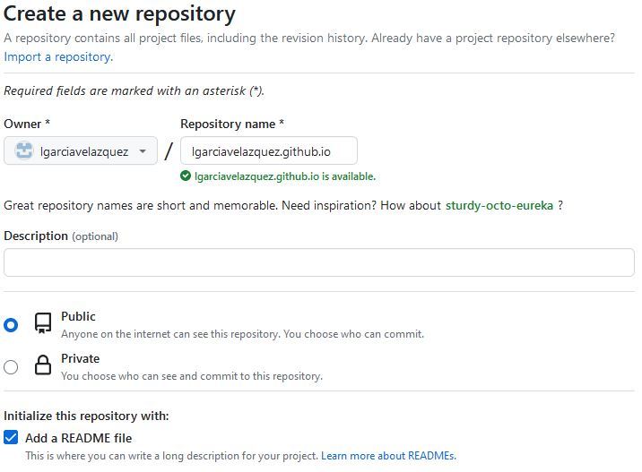

# Tutorial de GitHub Pages
GitHub Pages es un servicio de alojamiento de sitio estático que toma archivos HTML, CSS y JavaScript directamente desde un repositorio en GitHub, opcionalmente ejecuta los archivos a través de un proceso de compilación y publica un sitio web. 

Puede hospedar el sitio en el dominio `github.io` de GitHub o un dominio personalizado propio. 

## Tipos de sitios GitHub Pages

Existen tres tipos básicos de _GitHub Pages_ sitios: 

* **Usuario**:  Se conecta a una cuenta específica de usuario en `GitHub.com`. Para publicar un sitio de usuario, debes crear un repositorio propiedad de la cuenta personal denominado `username.github.io`. Disponible en `http(s)://username.github.io` 
* **Organización**. Se conecta a una cuenta específica de organización en GitHub.com. Para publicar un sitio de organización, debe crear un repositorio propiedad de una organización denominado `organization.github.io`. Disponible en `http(s)://organization.github.io`
* **Proyecto**: Están conectados con un proyecto/repositorio específico alojado en GitHub. Los archivos fuente para un sitio de proyecto se almacenan en el mismo repositorio que su proyecto. Disponibles en `http(s)://username.github.io/repository` o `http(s)://organization.github.io/repository`.

Solo puedes crear **un sitio** de **organización** o de **usuario** para cada cuenta en GitHub. Los sitios de **proyectos o repositorios**, ya sean propiedad de una cuenta de organización o personal, son **ilimitados**.

## Publicar fuentes para sitios de GitHub Pages
Puedes publicar el sitio cuando se inserten cambios en una rama específica o puedes escribir un flujo de trabajo de _GitHub Actions_ para publicar el sitio.

Si no necesitas ningún control sobre el proceso de creación del sitio, se recomienda publicar el sitio cuando se inserten cambios en una rama específica. Puedes especificar qué rama y carpeta usar como origen de publicación. En general existen dos maneras de configurar la rama origen del "website" de GittHub Pages:
1. Usar el directorio **/docs** de la rama ___main___ 
2. Usar el **directorio root(/)** de una rama llamada ___gh-pages___.

Cuando se insertan cambios en la rama de origen, los cambios en la carpeta de origen se publicarán en el sitio de __GitHub Pages__. 

## Generadores de sitios estáticos
_GitHub Pages_ publica cualquier archivo estático que subas a tu repositorio. Puedes crear tus propios archivos estáticos o usar un generador de sitios estáticos para que desarrolle tu sitio (por ejemplo _Jekyll_). 

Si publicas el sitio desde una rama de origen, __GitHub Pages__ usará _Jekyll_ para compilar tu sitio de forma predeterminada. 

Si usas un proceso de compilación personalizado o un generador de sitios estáticos distinto de _Jekyll_, puedes escribir un _GitHub Actions_ para compilar y publicar el sitio. _GitHub_ proporciona flujos de trabajo de inicio para varios generadores de sitios estáticos. De lo contrario, desactiva el proceso de compilación de _Jekyll_ creando un archivo vacío denominado _.nojekyll_ en la raíz de la fuente de publicación y, después, sigue las instrucciones del generador de sitios estáticos para crear el sitio localmente.

_GitHub Pages_ **no soporta** lenguajes del lado del servidor como PHP, Ruby o Python.

# Crear un sitio de Páginas de GitHub

## Crear un repositorio para tu sitio

Puedes crear un repositorio o elegir un repositorio existente para el sitio.

Si quieres crear un sitio de GitHub Pages para un repositorio donde no todos los archivos del repositorio están relacionados con el sitio, podrás configurar una fuente de publicación para el sitio.  
Por ejemplo, puedes tener una rama dedicada y una carpeta para contener los archivos de origen del sitio , o bien usar un flujo de trabajo de _GitHub Actions_ personalizado para compilar e implementar los archivos de origen del sitio.

En la esquina superior derecha de cualquier página selecciona New (Nuevo repositorio).

Escribe un nombre para tu repositorio y una descripción opcional. Si va a crear un sitio de usuario u organización, el repositorio debe tener el nombre `username.github.io` o `organization.github.io`. 

## Crear tu sitio
Antes de que puedas crear tu sitio, debes tener un repositorio para el mismo en GitHub. 

1. En GitHub, navega al repositorio de tu sitio. 
2. Decide qué fuente de publicación quieres utilizar: 
   1. Usar el directorio **/docs** de la rama _main_ 
   2. Usar el **root directory** de una rama llamada _gh-pages_.
   3. Flujo de trabajo de _GitHub Actions_.
3. Configura una fuente de publicación:

En la siguiente figura decidimos utilizar como fuente de publicación el directorio /doc de la rama _main_:

En la siguiente figura decidimos utilizar como fuente de publicación el directorio raíz de una nueva rama llama gh-pages: 

4. Crea el archivo de entrada para el sitio. GitHub Pages buscará un archivo `index.html`, `index.md` o `README.md` como archivo de entrada para el sitio.

Si el origen de publicación es una rama y una carpeta, el archivo de entrada debe estar en el nivel superior de la carpeta de origen de la rama de origen. Por ejemplo, si la fuente de publicación es la carpeta /docs de la rama main, el archivo de entrada debe estar en la carpeta /docs de una rama denominada main.

5. En el nombre del repositorio, haz clic en  Configuración. Si no puedes ver la pestaña "Configuración", selecciona el menú desplegable  y, a continuación, haz clic en Configuración.

6. En la sección "Código y automatización" de la barra lateral, haz clic en  Páginas.

En la siguiente figura desplegamos el sitio en el directorio /docs de la rama _main_.

En la siguiente figura desplegamos el sitio en el directorio raíz (/) de la rama _gh-pages_

1. Para ver el sitio publicado, en "GitHub Pages", haz clic en  Visitar sitio.

Nota: Es posible que la publicación de los cambios en el sitio tome hasta 10 minutos después de que envíes los cambios a GitHub. Si no ves los cambios del sitio de GitHub Pages reflejados en el explorador después de una hora, se pueden deber a errores en los documentos.

8. Su GitHub Pages sitio se construye y se implementa con un GitHub Actions flujo de trabajo. Para más información, consulta "Visualizar el historial de ejecución del flujo de trabajo".

## Pasos siguientes
Puedes agregar más páginas a tu sitio creando más archivos nuevos. Cada archivo estará disponible en tu sitio en la misma estructura de directorios que tu fuente de publicación. Por ejemplo, si el origen de publicación del sitio del proyecto es la rama _gh-pages_ y crea un nuevo archivo denominado /about/contact-us.md en la rama gh-pages, el archivo estará disponible en `https://username.github.io/repositor>/about/contact-us.html`.

También puedes agregar un tema para personalizar la apariencia de tu sitio. Para personalizar aún más tu sitio, puedes usar Jekyll, un generador de sitio estático con soporte integrado para GitHub Pages. 